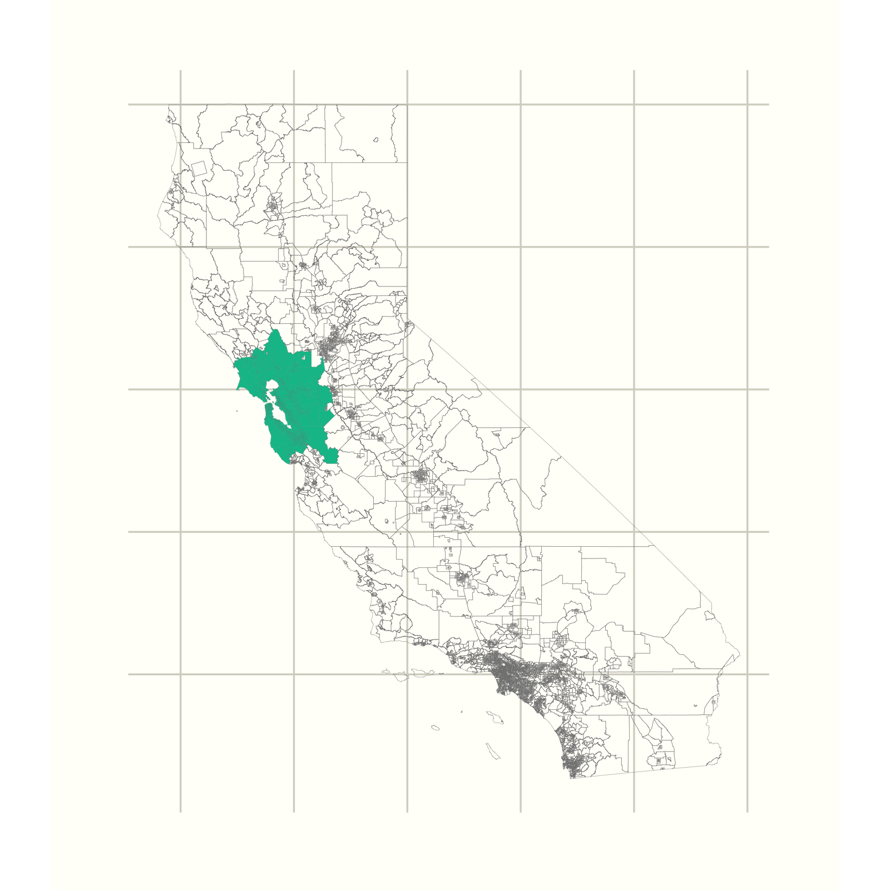

# haterzmapper

An `R` package for mapping diversity (ethnic, racial, linguistic or otherwise).

`haterzmapper` extends some of the functionality of the `sf` and `tidycensus` packages making it simple to subset simple feature data structures and gather census related data pertaining to specific geographies. It also provides some handy diversity functions (*ex*. *shannon index*).

#### Why is it called "haterzmapper"

This package is a product of my research, which involves understanding the geography of diversity and peoples' perceptions of other populations. This project is called `haterz` and, since this is a primarily geographic extension of that project, `haterzmapper` seemed most appropriate. 


## Example 

```splus
library(sf)
library(ggplot2)
library(haterzmapper)
library(tidycensus)


# gather census tracts of California from tidycensus
ca <- tidycensus::get_acs(geography = "tract", variables = "B00001_001",
                          state = "CA", geometry = TRUE)

# lat and lon of San Fran center
sflon <- topcities[topcities$full_name == "San Francisco, CA",]$lon 
sflat <- topcities[topcities$full_name == "San Francisco, CA",]$lat

# subset San Fran by 80 km radius
sf <- subset_map(ca, long = sflon, lat = sflat, dist = 80000)

# plot both layers
ggplot() +
  geom_sf(data = ca, colour = '#828282', fill = 'white', size = 0.05, alpha = 0) +
  geom_sf(data = sf, colour = '#828282', fill = '#00bf98', size = 0.001) +
  map_theme_stark()
```


